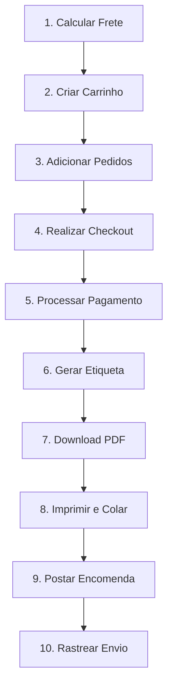

# 📦 Guia Completo: API SuperFrete - Integração e Emissão de Etiquetas

## 📋 Índice

1. [Introdução](#introdução)
2. [Configuração Inicial](#configuração-inicial)
3. [Ambientes de Desenvolvimento](#ambientes-de-desenvolvimento)
4. [Autenticação](#autenticação)
5. [Endpoints Principais](#endpoints-principais)
6. [Fluxo de Emissão de Etiquetas](#fluxo-de-emissão-de-etiquetas)
7. [Exemplos de Código](#exemplos-de-código)
8. [Testes no Sandbox](#testes-no-sandbox)
9. [Boas Práticas](#boas-práticas)
10. [Troubleshooting](#troubleshooting)

---

## 🎯 Introdução

A **API SuperFrete** é uma solução gratuita que permite integrar serviços de cálculo e emissão de fretes com até 80% de desconto em sua plataforma de e-commerce. A integração é totalmente gratuita, sem mensalidades ou taxas escondidas.

### Principais Benefícios:
- ✅ Cálculo automático de frete no checkout
- ✅ Emissão de etiquetas com desconto
- ✅ Rastreamento em tempo real
- ✅ Integração com Correios, Jadlog e Loggi
- ✅ Sem contrato ou volume mínimo

---

## 🔧 Configuração Inicial

### Passo 1: Criar Conta na SuperFrete

1. Acesse [SuperFrete](https://superfrete.com)
2. Cadastre-se com CPF ou CNPJ
3. Confirme seu e-mail
4. Acesse o painel administrativo

### Passo 2: Preparar o Ambiente de Desenvolvimento

Requisitos técnicos:
- **Linguagem**: Qualquer linguagem com suporte a requisições HTTP
- **Protocolo**: HTTPS
- **Formato de dados**: JSON
- **Autenticação**: Bearer Token

---

## 🌐 Ambientes de Desenvolvimento

A SuperFrete oferece dois ambientes distintos:

### 1. Ambiente Sandbox (Testes)
```
Base URL: https://sandbox.superfrete.com/api/v0/
Painel: https://sandbox.superfrete.com
```

**Características:**
- Ambiente para testes de integração
- Etiquetas geradas não são válidas para postagem
- Saldo de teste disponível para simulações
- Ideal para desenvolvimento e testes

### 2. Ambiente Produção
```
Base URL: https://api.superfrete.com/api/v0/
Painel: https://app.superfrete.com
```

**Características:**
- Ambiente real para operações comerciais
- Etiquetas válidas para postagem
- Cobranças reais aplicadas
- Usar após validação completa no Sandbox

---

## 🔐 Autenticação

### Gerando o Token de Acesso

#### Para Sandbox:
1. Acesse: https://sandbox.superfrete.com
2. Navegue até **Configurações > Integrações**
3. Clique em **"Integrar em Desenvolvedores"**
4. Clique em **"Confirmar"**
5. Copie o token gerado

#### Para Produção:
1. Acesse: https://app.superfrete.com
2. Siga os mesmos passos do Sandbox
3. **IMPORTANTE**: Tokens são específicos por ambiente

### Headers Obrigatórios

Todas as requisições devem incluir:

```http
Authorization: Bearer {SEU_TOKEN_AQUI}
User-Agent: NomeDaSuaApp/versao (seu_email@contato.com)
Accept: application/json
Content-Type: application/json
```

**Exemplo cURL:**
```bash
curl --request POST \
  --url https://sandbox.superfrete.com/api/v0/calculator \
  --header 'Authorization: Bearer SEU_TOKEN_AQUI' \
  --header 'User-Agent: MinhaLoja/1.0 (contato@minhaloja.com)' \
  --header 'Accept: application/json' \
  --header 'Content-Type: application/json' \
  --data '{...}'
```

---

## 📍 Endpoints Principais

### 1. Calculadora de Frete
```
POST /api/v0/calculator
```

Calcula opções de frete disponíveis para um envio.

**Payload de Exemplo:**
```json
{
  "from": {
    "postal_code": "01310-100"
  },
  "to": {
    "postal_code": "04543-000"
  },
  "package": {
    "height": 10,
    "width": 15,
    "length": 20,
    "weight": 0.5
  },
  "services": ["SEDEX", "PAC"],
  "options": {
    "insurance_value": 50.00,
    "receipt": false,
    "own_hand": false
  }
}
```

### 2. Criação de Carrinho
```
POST /api/v0/cart
```

Cria um carrinho para posterior checkout.

**Payload de Exemplo:**
```json
{
  "orders": [
    {
      "from": {
        "name": "Loja Exemplo",
        "postal_code": "01310-100",
        "address": "Av. Paulista",
        "number": "1000",
        "district": "Bela Vista",
        "city": "São Paulo",
        "state": "SP",
        "country": "BR",
        "email": "loja@exemplo.com",
        "phone": "11999999999"
      },
      "to": {
        "name": "Cliente Teste",
        "postal_code": "04543-000",
        "address": "Rua Exemplo",
        "number": "123",
        "district": "Vila Exemplo",
        "city": "São Paulo",
        "state": "SP",
        "country": "BR",
        "email": "cliente@exemplo.com",
        "phone": "11888888888",
        "document": "12345678901"
      },
      "package": {
        "height": 10,
        "width": 15,
        "length": 20,
        "weight": 0.5
      },
      "service": "PAC",
      "products": [
        {
          "name": "Produto Exemplo",
          "quantity": 1,
          "unitary_value": 50.00
        }
      ],
      "insurance_value": 50.00
    }
  ]
}
```

### 3. Checkout (Compra de Etiquetas)
```
POST /api/v1/checkout
```

Finaliza a compra das etiquetas criadas no carrinho.

**Payload de Exemplo:**
```json
{
  "cart_id": "CART_ID_RETORNADO",
  "payment_method": "credit_card",
  "orders": [
    {
      "id": "ORDER_ID_DO_CARRINHO",
      "invoice": {
        "key": "CHAVE_NFE_OPCIONAL"
      }
    }
  ]
}
```

### 4. Consulta de Etiquetas
```
GET /api/v0/labels
```

Lista todas as etiquetas emitidas.

### 5. Download de Etiquetas
```
GET /api/v0/labels/{label_id}/download
```

Baixa o PDF da etiqueta específica.

### 6. Rastreamento
```
GET /api/v0/tracking/{tracking_code}
```

Obtém informações de rastreamento do pedido.

---

## 📮 Fluxo de Emissão de Etiquetas

### Passo a Passo Completo:



### Detalhamento dos Passos:

#### 1️⃣ **Calcular Frete**
```javascript
// Node.js exemplo
const axios = require('axios');

async function calcularFrete(cepOrigem, cepDestino, peso, altura, largura, comprimento) {
  const response = await axios.post(
    'https://sandbox.superfrete.com/api/v0/calculator',
    {
      from: { postal_code: cepOrigem },
      to: { postal_code: cepDestino },
      package: {
        height: altura,
        width: largura,
        length: comprimento,
        weight: peso
      },
      services: ["PAC", "SEDEX"]
    },
    {
      headers: {
        'Authorization': 'Bearer SEU_TOKEN',
        'User-Agent': 'MinhaApp/1.0 (email@exemplo.com)',
        'Content-Type': 'application/json'
      }
    }
  );
  
  return response.data;
}
```

#### 2️⃣ **Criar Carrinho com Pedidos**
```javascript
async function criarCarrinho(dadosPedido) {
  const response = await axios.post(
    'https://sandbox.superfrete.com/api/v0/cart',
    {
      orders: [dadosPedido]
    },
    {
      headers: {
        'Authorization': 'Bearer SEU_TOKEN',
        'User-Agent': 'MinhaApp/1.0 (email@exemplo.com)',
        'Content-Type': 'application/json'
      }
    }
  );
  
  return response.data.cart_id;
}
```

#### 3️⃣ **Realizar Checkout**
```javascript
async function realizarCheckout(cartId, orderId) {
  const response = await axios.post(
    'https://sandbox.superfrete.com/api/v1/checkout',
    {
      cart_id: cartId,
      payment_method: 'pix', // ou 'credit_card', 'wallet'
      orders: [
        {
          id: orderId,
          invoice: {
            key: "CHAVE_NFE" // Opcional
          }
        }
      ]
    },
    {
      headers: {
        'Authorization': 'Bearer SEU_TOKEN',
        'User-Agent': 'MinhaApp/1.0 (email@exemplo.com)',
        'Content-Type': 'application/json'
      }
    }
  );
  
  return response.data;
}
```

#### 4️⃣ **Download da Etiqueta**
```javascript
async function downloadEtiqueta(labelId) {
  const response = await axios.get(
    `https://sandbox.superfrete.com/api/v0/labels/${labelId}/download`,
    {
      headers: {
        'Authorization': 'Bearer SEU_TOKEN',
        'User-Agent': 'MinhaApp/1.0 (email@exemplo.com)'
      },
      responseType: 'arraybuffer'
    }
  );
  
  // Salvar PDF
  const fs = require('fs');
  fs.writeFileSync(`etiqueta_${labelId}.pdf`, response.data);
  
  return `etiqueta_${labelId}.pdf`;
}
```

---

## 🧪 Testes no Sandbox

### Configurando Saldo de Teste

1. Acesse: https://sandbox.superfrete.com/#/account/credits
2. Adicione saldo fictício à carteira de teste
3. Use este saldo para testar emissões

### Dados de Teste Recomendados

```javascript
const dadosTeste = {
  // CEPs válidos para teste
  cepOrigem: "01310-100",    // São Paulo - SP
  cepDestino: "20040-020",   // Rio de Janeiro - RJ
  
  // Dimensões padrão
  pacote: {
    altura: 10,      // cm
    largura: 15,     // cm
    comprimento: 20, // cm
    peso: 0.5        // kg
  },
  
  // CPF de teste
  cpfTeste: "11111111111",
  
  // Cartão de teste (se aplicável)
  cartaoTeste: {
    numero: "4111111111111111",
    cvv: "123",
    validade: "12/25"
  }
};
```

---

## ✅ Boas Práticas

### 1. Segurança
- ⚠️ **NUNCA** exponha seu token em código cliente (JavaScript frontend)
- ✅ Mantenha tokens em variáveis de ambiente
- ✅ Use HTTPS em todas as comunicações
- ✅ Implemente rate limiting em sua aplicação

### 2. Performance
```javascript
// Implementar cache para cálculos de frete
const cache = new Map();

async function calcularFreteComCache(params) {
  const cacheKey = JSON.stringify(params);
  
  if (cache.has(cacheKey)) {
    const cached = cache.get(cacheKey);
    if (Date.now() - cached.timestamp < 3600000) { // 1 hora
      return cached.data;
    }
  }
  
  const result = await calcularFrete(params);
  cache.set(cacheKey, { data: result, timestamp: Date.now() });
  
  return result;
}
```

### 3. Tratamento de Erros
```javascript
async function apiCall(endpoint, data) {
  try {
    const response = await axios.post(endpoint, data);
    return { success: true, data: response.data };
  } catch (error) {
    console.error('Erro na API SuperFrete:', error.response?.data || error.message);
    
    // Tratamento específico por código de erro
    if (error.response?.status === 401) {
      return { success: false, error: 'Token inválido ou expirado' };
    }
    if (error.response?.status === 400) {
      return { success: false, error: 'Dados inválidos', details: error.response.data };
    }
    if (error.response?.status === 429) {
      return { success: false, error: 'Limite de requisições excedido' };
    }
    
    return { success: false, error: 'Erro desconhecido' };
  }
}
```

### 4. Validações
```javascript
// Validar CEP antes de enviar
function validarCEP(cep) {
  const cepLimpo = cep.replace(/\D/g, '');
  return /^[0-9]{8}$/.test(cepLimpo);
}

// Validar dimensões do pacote
function validarPacote(pacote) {
  const { altura, largura, comprimento, peso } = pacote;
  
  // Limites dos Correios
  const somaMaxima = 200; // cm
  const pesoMaximo = 30; // kg
  
  if (altura < 1 || largura < 10 || comprimento < 15) {
    return { valido: false, erro: 'Dimensões abaixo do mínimo' };
  }
  
  if (altura + largura + comprimento > somaMaxima) {
    return { valido: false, erro: 'Soma das dimensões excede o limite' };
  }
  
  if (peso > pesoMaximo) {
    return { valido: false, erro: 'Peso excede o limite' };
  }
  
  return { valido: true };
}
```

---

## 🔧 Troubleshooting

### Problemas Comuns e Soluções

#### ❌ Erro 401 - Unauthorized
**Causa**: Token inválido ou expirado
**Solução**: 
- Verifique se está usando o token correto para o ambiente
- Regenere o token no painel administrativo

#### ❌ Erro 400 - Bad Request
**Causa**: Dados inválidos no payload
**Solução**:
- Valide formato do CEP (8 dígitos)
- Verifique dimensões mínimas do pacote
- Confirme estrutura JSON

#### ❌ Erro 429 - Too Many Requests
**Causa**: Limite de requisições excedido
**Solução**:
- Implemente cache local
- Use exponential backoff
- Reduza frequência de chamadas

#### ❌ Etiqueta não sendo gerada
**Checklist**:
1. Saldo disponível na carteira?
2. Todos os dados do destinatário preenchidos?
3. Documento (CPF/CNPJ) válido?
4. Endereço completo com número?
5. Serviço de envio disponível para a região?

### Logs e Monitoramento

```javascript
// Sistema de logs para debug
class SuperFreteLogger {
  constructor() {
    this.logs = [];
  }
  
  log(tipo, mensagem, dados = {}) {
    const entry = {
      timestamp: new Date().toISOString(),
      tipo,
      mensagem,
      dados
    };
    
    this.logs.push(entry);
    
    if (process.env.NODE_ENV === 'development') {
      console.log(`[SuperFrete ${tipo}]`, mensagem, dados);
    }
  }
  
  getLogs() {
    return this.logs;
  }
}

const logger = new SuperFreteLogger();
```

---

## 📊 Métricas e Monitoramento

### KPIs Importantes

```javascript
// Monitorar métricas da integração
class SuperFreteMetrics {
  constructor() {
    this.metrics = {
      calculosRealizados: 0,
      etiquetasEmitidas: 0,
      errosAPI: 0,
      tempoMedioResposta: 0
    };
  }
  
  trackCalculation(tempoResposta) {
    this.metrics.calculosRealizados++;
    this.updateAverageResponseTime(tempoResposta);
  }
  
  trackLabel() {
    this.metrics.etiquetasEmitidas++;
  }
  
  trackError() {
    this.metrics.errosAPI++;
  }
  
  getReport() {
    return {
      ...this.metrics,
      taxaErro: (this.metrics.errosAPI / this.metrics.calculosRealizados * 100).toFixed(2) + '%'
    };
  }
}
```

---

## 🚀 Próximos Passos

### Após a Integração:

1. **Teste Completo no Sandbox**
   - [ ] Calcular frete para diferentes CEPs
   - [ ] Emitir etiquetas de teste
   - [ ] Testar diferentes formas de pagamento
   - [ ] Validar fluxo de rastreamento

2. **Migração para Produção**
   - [ ] Gerar token de produção
   - [ ] Atualizar URLs da API
   - [ ] Adicionar saldo real na carteira
   - [ ] Configurar dados fiscais

3. **Otimizações**
   - [ ] Implementar webhooks para status
   - [ ] Criar dashboard de métricas
   - [ ] Automatizar impressão de etiquetas
   - [ ] Integrar com ERP/WMS

---

## 📞 Suporte

### Canais de Atendimento:

- **E-mail**: [email protected]
- **Chat**: Disponível no painel administrativo
- **Documentação**: https://superfrete.readme.io
- **Status da API**: https://status.superfrete.com

### Recursos Adicionais:

- [Calculadora de Frete Online](https://superfrete.com/calculadora)
- [Blog com Tutoriais](https://superfrete.com/blog)
- [Vídeos de Integração](https://youtube.com/superfrete)

---

## 📄 Apêndice: Exemplo Completo

### Implementação Node.js/Express

```javascript
const express = require('express');
const axios = require('axios');
require('dotenv').config();

const app = express();
app.use(express.json());

const SUPERFRETE_TOKEN = process.env.SUPERFRETE_TOKEN;
const SUPERFRETE_URL = process.env.NODE_ENV === 'production' 
  ? 'https://api.superfrete.com/api/v0'
  : 'https://sandbox.superfrete.com/api/v0';

// Configuração do cliente HTTP
const superFreteClient = axios.create({
  baseURL: SUPERFRETE_URL,
  headers: {
    'Authorization': `Bearer ${SUPERFRETE_TOKEN}`,
    'User-Agent': 'MinhaLoja/1.0 (contato@minhaloja.com)',
    'Content-Type': 'application/json'
  }
});

// Endpoint para calcular frete
app.post('/api/shipping/calculate', async (req, res) => {
  try {
    const { from, to, package } = req.body;
    
    const response = await superFreteClient.post('/calculator', {
      from,
      to,
      package,
      services: ['PAC', 'SEDEX']
    });
    
    res.json({
      success: true,
      options: response.data
    });
  } catch (error) {
    res.status(500).json({
      success: false,
      error: error.response?.data || 'Erro ao calcular frete'
    });
  }
});

// Endpoint para emitir etiqueta
app.post('/api/shipping/label', async (req, res) => {
  try {
    const { order } = req.body;
    
    // 1. Criar carrinho
    const cartResponse = await superFreteClient.post('/cart', {
      orders: [order]
    });
    
    const cartId = cartResponse.data.id;
    const orderId = cartResponse.data.orders[0].id;
    
    // 2. Realizar checkout
    const checkoutResponse = await superFreteClient.post('/checkout', {
      cart_id: cartId,
      payment_method: 'pix',
      orders: [{ id: orderId }]
    });
    
    res.json({
      success: true,
      label: checkoutResponse.data
    });
  } catch (error) {
    res.status(500).json({
      success: false,
      error: error.response?.data || 'Erro ao emitir etiqueta'
    });
  }
});

// Endpoint para rastreamento
app.get('/api/shipping/track/:code', async (req, res) => {
  try {
    const { code } = req.params;
    
    const response = await superFreteClient.get(`/tracking/${code}`);
    
    res.json({
      success: true,
      tracking: response.data
    });
  } catch (error) {
    res.status(500).json({
      success: false,
      error: error.response?.data || 'Erro ao rastrear envio'
    });
  }
});

const PORT = process.env.PORT || 3000;
app.listen(PORT, () => {
  console.log(`Servidor rodando na porta ${PORT}`);
  console.log(`Ambiente: ${process.env.NODE_ENV || 'development'}`);
});
```

### Arquivo .env

```env
# Desenvolvimento
SUPERFRETE_TOKEN=seu_token_sandbox_aqui
NODE_ENV=development

# Produção (comentado)
# SUPERFRETE_TOKEN=seu_token_producao_aqui
# NODE_ENV=production
```

---

## 🎓 Conclusão

Este guia fornece uma base sólida para integração com a API SuperFrete. Lembre-se de sempre:

1. Começar pelo ambiente Sandbox
2. Testar todos os cenários possíveis
3. Implementar tratamento de erros robusto
4. Monitorar métricas de performance
5. Manter documentação atualizada

Com a integração correta, você poderá oferecer fretes competitivos e melhorar significativamente a experiência de compra dos seus clientes.

**Boa integração! 🚀**

---

*Última atualização: Novembro 2024*
*Versão do documento: 1.0*